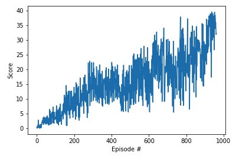

### Algorithm
We implemented a DDPQ as proposed by [[Lillicrap, Hunt, et. al.](http://arxiv.org/abs/1509.02971). DDQP is extends the [famous DQN algorithm](http://www.nature.com/articles/nature14236) s.t. it is able to train agents with continuous action spaces.
Compared to DQN, an additional neural network (the actor) is introduced, which is trained to approximate the optimal policy directly. The Q-Network (the critic) still exists and serves as a judge to the actor.

In order to speed up convergence we implemented two additions compared to the originally proposed implementation:
* Batch normalization as proposed in [Ioffe and Szegedy](http://arxiv.org/abs/1502.03167)
* Set local and target network weights to equal values at initialization (for both actor and critic)

### Learning Curve

Score plot of our best attempt: An agent that solved the environment in 862 episodes. This is not really good, but the total training time (about 3.5 hours) was found to be comparable to solutions from other Udacity students. 

The score (cumulated reward per episode) is increasing over time - the agent learns to play.

### Hyperparameters
We took a rather heuristic approach for finding the right configuration of our agent. The main ingredients of our model are:

 - Actor & Critic Networks: 2 hidden layers with (256,128) units each and relu activation (hidden units); batch normalization after the first layer of the actor
 - BUFFER_SIZE = 1e5 (replay buffer size)
 - BATCH_SIZE = 128 (minibatch size)   
 - GAMMA = 0.99 (discount factor)
 - TAU = 1e-3 (for soft update of target parameters)
 - LR_ACTOR = 3e-4 (learning rate of the actor)
 - LR_CRITIC = 2e-4 (learning rate of the critic)
 - WEIGHT_DECAY = 1e-4 (L2 weight decay)
 - max_t = 3000 (maximum number of timesteps per episode)
 - Exploratory Noise Parameters: mu=0, theta=0.15, sigma=0.1
 
 Introducing batch normalization was the crucial step to speed up convergence by a large factor. Tuning the other parameters did not change convergence speed significantly. However, our solution needs far more episodes than comparable solutions of other students (around 200-300 episodes) and it would be interesting to look at this in detail.

### Improvements / Ideas for Future Work
Further improvements could be:
 - Leverage parallel / distributed training using the 20 agent environment
 - Implement Prioritized Experience Replay
 - Do a more systematic hyperparameter search/tuning
 - Try solving other environments using a similar DDPQ implementation (e.g. the Crawler)
